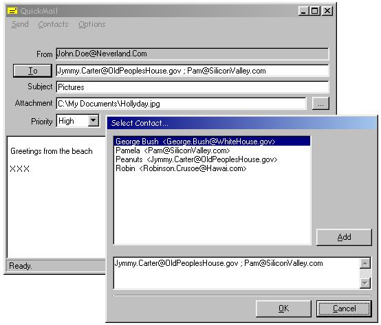



## \[ QuickMail \]

### Description

QuickMail is a ready to use basic mailer, based on winsock, featuring multiple adressing, attachments encoded with base64, winsock statusbar, Contacts list and mailsender information edit. Full error handling. Good code to learn the basic of winsock mailing and the MIME 1.0 mail format. This is an 'upgraded' and rewritten version of my FastMailer submission (deleted). Special Thanks to Alon Gal for the winsock and MIME basics. All comments and suggestions welcom :-)
 
### More Info
 

             |
---                |---
**Submitted On**   |2004-10-10 11:08:54
**By**             |[D\. Rijmenants](https://github.com/Planet-Source-Code/PSCIndex/blob/master/ByAuthor/d-rijmenants.md)
**Level**          |Beginner
**User Rating**    |4.7 (84 globes from 18 users)
**Compatibility**  |VB 5\.0, VB 6\.0
**Category**       |[Internet/ HTML](https://github.com/Planet-Source-Code/PSCIndex/blob/master/ByCategory/internet-html__1-34.md)
**World**          |[Visual Basic](https://github.com/Planet-Source-Code/PSCIndex/blob/master/ByWorld/visual-basic.md)
**Archive File**   |[\[\_QuickMai18033810102004\.zip](https://github.com/Planet-Source-Code/d-rijmenants-quickmail__1-56565/archive/master.zip)

